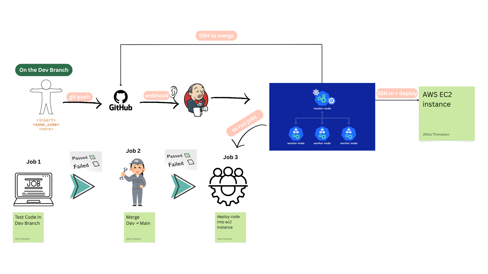
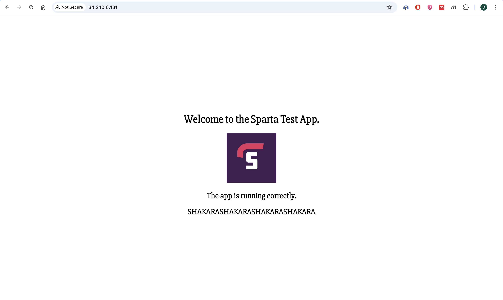

#  Setting Up a Jenkins Server on AWS EC2

This guide walks you through setting up a Jenkins server on an AWS EC2 instance using Ubuntu.

---
- [Setting Up a Jenkins Server on AWS EC2](#setting-up-a-jenkins-server-on-aws-ec2)
  - [Step 1: Launch an EC2 Instance](#step-1-launch-an-ec2-instance)
    - [Configuration:](#configuration)
  - [Step 2: Connect to the EC2 Instance](#step-2-connect-to-the-ec2-instance)
  - [Step 3: Install Java](#step-3-install-java)
  - [Step 4: Install Jenkins](#step-4-install-jenkins)
  - [Step 5: Start Jenkins](#step-5-start-jenkins)
  - [Step 7: Retrieve the Initial Admin Password](#step-7-retrieve-the-initial-admin-password)
  - [Step 8: Sign in to Jenkins GUI](#step-8-sign-in-to-jenkins-gui)
- [Setting up Jenkins CICD pipeline](#setting-up-jenkins-cicd-pipeline)
  - [Structure of the CICD Pipeline](#structure-of-the-cicd-pipeline)
  - [Logging in to Jenkins](#logging-in-to-jenkins)
  - [Create GitHub App repo](#create-github-app-repo)
  - [Generating SSH key](#generating-ssh-key)
  - [Adding public key to GitHub Repo](#adding-public-key-to-github-repo)
  - [Creating Job 1 on Jenkins](#creating-job-1-on-jenkins)
    - [Setting up webhook](#setting-up-webhook)
      - [What is a webhook](#what-is-a-webhook)
      - [Steps](#steps)
  - [Creating Job 2 on Jenkins](#creating-job-2-on-jenkins)
    - [Purpose](#purpose)
    - [Steps](#steps-1)
  - [Creating Job 3 on Jenkins](#creating-job-3-on-jenkins)
    - [Goals](#goals)
    - [Steps](#steps-2)
    - [Blockers](#blockers)

---

Below is a schematic detailing the different aspects and steps involved in setting up the CI/CD pipeline for the Sparta test app using a Jenkins server 
 

Refer to the [Jenkins Documentation](https://www.jenkins.io/doc/) for advanced setup and plugin usage.

##  Step 1: Launch an EC2 Instance
### Configuration:
- **AMI**: Ubuntu Server 22.04 LTS 
- **Instance Type**: `t3.micro` (Free Tier eligible)
- **Key Pair**: used an existing key-pair
- **Security Group**:
  - Allow **SSH (port 22)** from my IP
  - Allow **HTTP (port 80)** and **Jenkins (port 8080)** from my IP address

---

##  Step 2: Connect to the EC2 Instance

Open terminal and connect using SSH:

```bash
ssh -i "shakara-aws-sparta.pem" ubuntu@ec2-34-252-77-146.eu-west-1.compute.amazonaws.com
```
## Step 3: Install Java
Jenkins requires Java (Java 11 or higher recommended):
```bash
sudo apt update
sudo apt install -y openjdk-17-jdk
java -version
```

## Step 4: Install Jenkins

``` bash
curl -fsSL https://pkg.jenkins.io/debian-stable/jenkins.io-2023.key | sudo tee \
  /usr/share/keyrings/jenkins-keyring.asc > /dev/null

echo deb [signed-by=/usr/share/keyrings/jenkins-keyring.asc] \
  https://pkg.jenkins.io/debian-stable binary/ | sudo tee \
  /etc/apt/sources.list.d/jenkins.list > /dev/null

sudo apt update
sudo apt install -y jenkins
```
## Step 5: Start Jenkins
```bash
sudo systemctl enable jenkins
sudo systemctl start jenkins
```
Check the service status of the Jenkins server by going to the following URL:
``` bash
http://your-ec2-public-ip:8080
```
It will ask for an admin password

```
http://3.253.13.198:8080
```


## Step 7: Retrieve the Initial Admin Password
``` bash
sudo cat /var/lib/jenkins/secrets/initialAdminPassword
```
Copy the output and paste it into the Jenkins setup page.

 

## Step 8: Sign in to Jenkins GUI
- create an account, I used admin 
- Jenkins GUI
   

# Setting up Jenkins CICD pipeline 
## Structure of the CICD Pipeline 
## Logging in to Jenkins 
- Log in to Jenkins with the appropriate credentials. 
## Create GitHub App repo
## Generating SSH key 
## Adding public key to GitHub Repo
## Creating Job 1 on Jenkins
- Name: `<name>-job1-ci-test`
- Click on `Freestyle Project`
 
- Add a general description 
  - select `Git` 
  - enter the https repository URL
 
- **Source Code Managment**
  - Select `Git`
  - add ssh url from github repo in `Repository URL`
  - If you haven't added your private key generated earlier you will need to click `add` below the `Credentials` dropdown box
  - and add the relevant details including 
 
    - Branches to build select `main` or `dev` if you've created a dev branch
- **Build Triggers**
  - Select `GitHub hook trigger for GITScm polling` 
  - N.B. after you've set up your webhook, instructions in section 
- **Build Environment**
  - Select `Provide Node & npm bin/ folder to PATH` and fill out the correct version of NodeJS version 20
  -   
- **Build Steps**
  - select `Execute Shell` from the drop down and enter the following into the shell
  

Double check everything is correct then click Save.
On the Dashboard Click `Build Now`

### Setting up webhook 
#### What is a webhook
- a webhook is a way for external systems (like GitHub, GitLab, or Bitbucket) to notify Jenkins automatically when certain events occur—most commonly, when code is pushed to a repository.

#### Steps 
1. Edit the configuration of job 1 in the section `Build Triggers` select `GitHub hook trigger for GITScm polling`  
2. go to the the github repo page for the app and click on the `Settings`
3. On the lefthand side under the list of options below `General` Select `Webhooks`
4. Select `add webhooks`
5. Fill in the details e.g.
  

## Creating Job 2 on Jenkins
### Purpose 
### Steps
- Click `New Item`
- As in Job 1 add `Enter an item name` :  `shakara-job2-ci-merge`
-  Go to the bottom of the page to `create a new item from other existing, you can use this option: ` 
-  In the `Copy From`  select the job/item to copy as template in this case `shakara-job1-ci-test`
-  Click `OK`
-  This takes you to the `General` page where you can fill in the details for the job configuration 
-  All the details filled are from job 1, the following details are different for job 2 
-  In the `Source Code Managment` Click on `Additional Behaviours`, see below 
   
- this automates the merging of the code from the dev branch to the main branch 
- In the `Build Environment` select `SSH Agent`
-     
- select the appropriate ssh private key, the one used in job 1
- In `Build Steps` remove the commands from job 1 and add
- Blockers here:
  - Did not select `SSH agent` which led to build failing 
  - Need to make changes to the dev branch to trigger the build of job 2 
``` bash 
git push origin HEAD:main
```
    - to push updated changes to the main branch 

- edit Job 1 the `Configuration` of job 1, scroll to the `Post Build Actions` and edit it according to the following 
 
- This will trigger job 2 after job 1 has built successfully 

- In the locally hosted repo on the dev branch add a change, i.e. Add a line to the README.md file 
 
- add, commit and push these changes to the dev branch 
- this will trigger the merging of the changes from the dev branch to the main branch 
  

## Creating Job 3 on Jenkins 
### Goals 
- Copy the updated & tested code from Jenkins to the AWS EC2 instance

### Steps
1. Creating new item
   - following the naming convention : 
        `<yourname>-job3-cd-deploy`
   - copy item from existing item i.e. job 2
2. Click `OK` to begin edditing the configuration details 
3. Create EC2 Instance using terraform/on the AWS gui 
   1. Security group: Allow TCP port 22, TCP port 80 and 3000
   2. See previous documentation for creating an EC2 instance (#TODO: add link)
4. Adding SSH key for EC2 instance to Jenkins server
   - In the top right corner, click on the drop down box titled `Trainee`
   - Select `Credentials`
   - you will be presented with a table containing the credentials associated with this Jenkins server 
   - In the `Domain` column select `global` 
   - Then select `Add Credentials` 
   - Fill out the form for new credentials including the following fields.

    | **Field**     | **Value**                                                                 |
    |---------------|---------------------------------------------------------------------------|
    | **Kind**       | `Secret file`                                                              |
    | **Scope**      | `Global` or `System` (depends on your job visibility needs)               |
    | **File**       | Upload the secret file from your local machine                            |
    | **ID**         | *(Optional)* A unique ID to reference in your Jenkinsfile (e.g., `aws-deploy-key`) |
    | **Description**| *(Optional)* Description for clarity                                       |
5. Editing the Configuration of the Jenkins Job 
   - `Build Steps`
```bash
#!/bin/bash
set -xe
# Variables
EC2_HOST="ubuntu@ec2-34-240-6-131.eu-west-1.compute.amazonaws.com"
APP_DIR="/home/ubuntu/sparta-app-for-jenkins"

# Prepare SSH
mkdir -p ~/.ssh
ssh-keyscan -H ec2-34-240-6-131.eu-west-1.compute.amazonaws.com >> ~/.ssh/known_hosts
chmod 400 "$PEM_FILE"

# Copy code from Jenkins workspace to EC2 instance
ssh -i "$PEM_FILE" "$EC2_HOST" "mkdir -p $APP_DIR"
scp -i "$PEM_FILE" -r "$WORKSPACE"/* "$EC2_HOST:$APP_DIR"

# SSH into EC2 and run commands
ssh -i "$PEM_FILE" "$EC2_HOST" << EOF
  set -xe
  cd "$APP_DIR/app"
  sudo systemctl restart nginx
  sudo systemctl enable nginx

  npm install
  # Find the PID of any process listening on port 3000
  PID=$(lsof -t -i:3000) || true
  
  if [ -n "$PID" ]; then
    echo "Killing process $PID on port 3000"
    sudo kill -9 $PID
  else
    echo "No process using port 3000"
  fi
  npm test

  # Assuming you want to install PM2 globally and restart the app
  sudo npm install -g pm2
  pm2 stop all || true
  pm2 start app.js --name app
EOF
```
6. EC2 Instance 
   - 
   - Security Groups: 
     - allow port 3000 
     - allow port 80
     - allow port 22
1. Editing Code 
   - edit code in local copy of repo i.e. index.js file 
   - add, commit and push the changes to the repo 
   - check the sparta app url, the IP address of the EC2 instance 
   - Below are screenshots of the changes made 
<p float="left">
  
  
</p>
<br>

### Blockers 
- Ensure the PM2 processes are stopped and deleted this will produce an error 
- use the commands `pm2 stop all && pm2 delete all`
- check `Console Output` on Jenkins Server to troubleshoot and debug possible reasons if job fails
